# KIPRIS 특허 AI 멀티에이전트 시스템

특허 수집 → AI 요약 → 카테고리 분류 → 리포트 생성

LangGraph 기반의 멀티 에이전트 파이프라인으로, KIPRIS 특허 데이터를 수집하고 AI를 활용하여 요약, 분류, 보고서를 자동 생성합니다.

## 🚀 주요 기능

- **자동 특허 수집**: KIPRIS API 또는 CSV 파일에서 특허 데이터 수집
- **AI 요약**: OpenAI GPT 모델을 활용한 특허 요약 생성
- **자동 분류**: 8개 카테고리로 특허 자동 분류
- **보고서 생성**: 마크다운 형식의 종합 보고서 자동 생성

## 📊 실행 흐름

```mermaid
flowchart TD
    Start([프로그램 시작<br/>asyncio.run]) --> Main[main 함수 호출]
    Main --> Banner[시스템 안내 메시지 출력]
    Banner --> Validate{Config.validate<br/>API 키 검증}
    
    Validate -->|실패| Error[ValueError 발생<br/>프로그램 종료]
    Validate -->|성공| InitLLM[ChatOpenAI 초기화<br/>모델: gpt-5-mini<br/>토큰: 150]
    
    InitLLM --> CreateWF[create_patent_workflow<br/>워크플로우 생성]
    CreateWF --> CreateAgents[4개 에이전트 인스턴스 생성]
    CreateAgents --> BuildGraph[StateGraph 생성 및 노드 연결]
    BuildGraph --> Compile[워크플로우 컴파일]
    
    Compile --> InitState[PatentState 초기화<br/>메시지 추가]
    InitState --> Invoke[app.ainvoke 실행<br/>LangGraph 워크플로우 시작]
    
    Invoke --> Collect[COLLECT 노드<br/>PatentCollectorAgent]
    Collect --> CheckCSV{CSV 파일<br/>존재?}
    
    CheckCSV -->|있음| LoadCSV[CSV에서 데이터 로드]
    CheckCSV -->|없음| CallAPI[KIPRIS API 호출]
    
    CallAPI --> ParseXML[XML 파싱]
    ParseXML --> SaveCSV[CSV 파일로 저장]
    SaveCSV --> UpdateState1[state.raw_patents 업데이트]
    LoadCSV --> UpdateState1
    
    UpdateState1 --> Summarize[SUMMARIZE 노드<br/>PatentSummarizerAgent]
    Summarize --> Batch1[배치 처리 시작]
    Batch1 --> AsyncSummarize[비동기 LLM 호출<br/>각 특허 요약]
    AsyncSummarize --> UpdateState2[state.summarized_patents 업데이트]
    
    UpdateState2 --> Organize[ORGANIZE 노드<br/>PatentOrganizerAgent]
    Organize --> Batch2[배치 처리 시작]
    Batch2 --> AsyncCategorize[비동기 LLM 호출<br/>카테고리 분류]
    AsyncCategorize --> UpdateState3[state.categorized_patents 업데이트]
    
    UpdateState3 --> Report[REPORT 노드<br/>ReportGeneratorAgent]
    Report --> GenerateMD[마크다운 보고서 생성]
    GenerateMD --> UpdateState4[state.final_report 업데이트]
    
    UpdateState4 --> EndNode[END 노드]
    EndNode --> ReturnState[final_state 반환]
    
    ReturnState --> CheckReport{final_report<br/>존재?}
    CheckReport -->|없음| Exit1[종료]
    CheckReport -->|있음| CreateDir[outputs/ 디렉토리 생성]
    
    CreateDir --> GenFilename[타임스탬프 기반 파일명 생성]
    GenFilename --> SaveFile[파일 저장<br/>UTF-8 인코딩]
    SaveFile --> PrintResult[결과 출력<br/>파일 경로, 특허 수, 미리보기]
    PrintResult --> Exit2[프로그램 종료]
    
    style Start fill:#e1f5ff
    style Error fill:#ffcccc
    style Collect fill:#fff4e6
    style Summarize fill:#e6f3ff
    style Organize fill:#f0e6ff
    style Report fill:#e6ffe6
    style EndNode fill:#ffcccc
    style Exit1 fill:#ffcccc
    style Exit2 fill:#ffcccc
```



## 🛠️ 설치 및 설정

### 필수 패키지 설치

```bash
pip install langgraph langchain-core langchain-openai pydantic python-dotenv requests pandas
```

### 환경 변수 설정

`.env` 파일을 생성하고 다음 변수를 설정하세요:

```env
OPENAI_API_KEY=your_openai_api_key
KIPRIS_API_KEY=your_kipris_api_key
```

## 📖 사용법

```bash
python main.py
```

## 🏗️ 시스템 구조

### 에이전트 구성

1. **PatentCollectorAgent**: 특허 데이터 수집
2. **PatentSummarizerAgent**: AI 요약 생성
3. **PatentOrganizerAgent**: 카테고리 분류
4. **ReportGeneratorAgent**: 보고서 생성

### 기술 스택

- **LangGraph**: 워크플로우 엔진
- **LangChain**: LLM 통합
- **OpenAI API**: AI 요약 및 분류
- **KIPRIS API**: 특허 데이터 수집

## 📁 프로젝트 구조

```
patent_multiagent/
├── main.py              # 프로그램 진입점
├── workflow.py           # 워크플로우 정의
├── state.py             # 상태 모델 정의
├── config.py            # 설정 관리
├── agents/              # 에이전트 모듈
│   ├── collector.py    # 데이터 수집 에이전트
│   ├── summarizer.py   # 요약 에이전트
│   ├── organizer.py    # 분류 에이전트
│   └── reporter.py     # 보고서 생성 에이전트
└── outputs/            # 생성된 보고서 저장 위치
```


